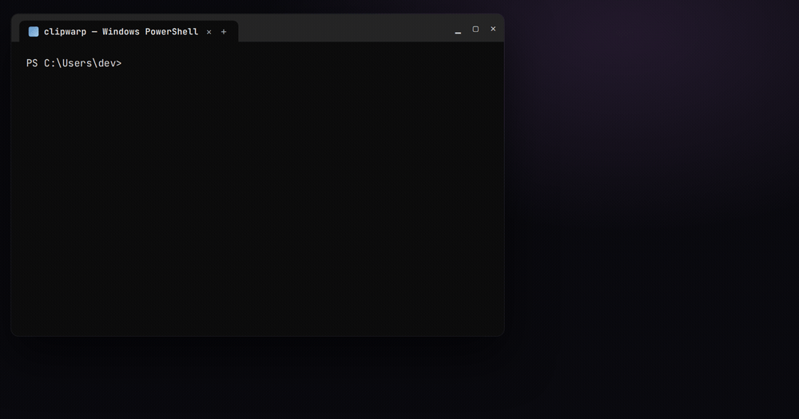

<div align="center">


# clipwarp

**Paste screenshots into Claude Code on Windows.**

Copy an image anywhere → press `Ctrl+V` in Claude Code → it attaches.
A tiny, local PowerShell utility. No admin, no dependencies.

[](#requirements)
[](#requirements)
[](LICENSE)
[](#install)



</div>

---

## The problem

On **native Windows**, Claude Code can't read an image from the clipboard.
`Ctrl+V` and `Alt+V` silently do nothing after you snip with Snipping Tool
(`Win+Shift+S`), Lightshot, ShareX, or "Copy image" in a browser — a long-standing
issue reported across
[anthropics/claude-code#22068](https://github.com/anthropics/claude-code/issues/22068),
[#26679](https://github.com/anthropics/claude-code/issues/26679), and
[#32791](https://github.com/anthropics/claude-code/issues/32791) (the latter two
still open; `Alt+V` only works under WSL).

What **always** works is a file **path** pasted as text — Claude Code auto-attaches
any `.png` / `.jpg` / `.gif` / `.webp` path it sees. **clipwarp** turns whatever
image is on your clipboard into exactly that, automatically:

```text
┌─────────────┐     ┌──────────────────────────────┐     ┌────────────────────┐
│  Win+Shift+S │ ──▶ │  clipwarp: save clipboard    │ ──▶ │  Ctrl+V in Claude  │
│  / Ctrl+C    │     │  image → PNG, put its path   │     │  Code = image      │
│  anywhere    │     │  on the clipboard as text    │     │  attached ✓        │
└─────────────┘     └──────────────────────────────┘     └────────────────────┘
```

## Install

One command in **PowerShell**:

```powershell
irm https://raw.githubusercontent.com/botnick/clipwarp/main/install.ps1 | iex
```

<sub>Or from a clone: `git clone https://github.com/botnick/clipwarp; .\clipwarp\install.ps1`</sub>

The installer copies the scripts to `%USERPROFILE%\.claude\scripts` and registers a
`clipwarp` command (plus a short **`cw`** alias) in the all-hosts profile of **both**
PowerShell editions — Windows PowerShell 5.1 and PowerShell 7 — so it works whichever
one you open. Idempotent; re-run any time to update. Open a **new** terminal
afterwards (or run `. $PROFILE`) so the command is found.

> No admin rights, no services, no dependencies — plain PowerShell and .NET classes
> that ship with Windows. Everything runs **locally**; images never leave your machine.

## Quick start

### Automatic (recommended) — plain `Ctrl+C` → `Ctrl+V`

```powershell
clipwarp watch       # start the background clipboard watcher, once
clipwarp autostart   # optional: also start it at every login
```

While the watcher runs, **every image that lands on the clipboard is converted
automatically** — snip, Lightshot, browser "Copy image", `Ctrl+C` on an image file.
Just `Ctrl+V` in Claude Code and the image attaches.

The clipboard is rewritten as **dual format**, so nothing else breaks:

| Paste target | What pastes |
|---|---|
| Claude Code / any terminal | the saved image's **path** (auto-attaches) |
| Photoshop, Word, Discord, a browser… | the original **image** |

Copies that carry meaningful text alongside an image (e.g. a paragraph from Word)
are left untouched — only pure image copies convert.

```powershell
clipwarp status       # is the watcher running? is autostart on?
clipwarp stop         # stop it
clipwarp unautostart  # remove the login autostart
```

> [!IMPORTANT]
> **Turn the watcher off when you're not using Claude Code.** While `clipwarp watch`
> is running, every copied image also carries its file **path** as text. Apps that
> accept images still paste the image — but a plain **text** box will receive the path
> instead (e.g. `C:\Users\you\.claude\pasted-images\clip-….png`). When you're done,
> run `clipwarp stop` (and `clipwarp unautostart` so it doesn't launch at next login).

### Manual — one command per paste

1. Snip or copy any image (`Win+Shift+S`, Lightshot, ShareX, a browser…).
2. Run **`cw`** (short for `clipwarp`).
3. Switch to Claude Code and press `Ctrl+V`. Done.

## Commands

| Command | What it does |
|---|---|
| `clipwarp watch` | Start the background auto-converter. |
| `clipwarp autostart` | Start the watcher automatically at every login. |
| `clipwarp status` | Is the watcher running? Is autostart on? |
| `clipwarp stop` | Stop the watcher. |
| `clipwarp unautostart` | Remove the login autostart. |
| `cw` | Short alias — convert the clipboard image once, then `Ctrl+V`. |

## Supported clipboard formats

clipwarp reads the clipboard in whatever format the source app actually used — this
is what makes it work where a naive `Get-Clipboard -Format Image` fails:

| Clipboard format | Typical source |
|---|---|
| `CF_BITMAP` / `CF_DIB` | Snipping Tool, `Win+Shift+S`, `PrtScn` |
| `PNG` / `image/png` stream | Lightshot, Chrome, Firefox, Discord, ShareX |
| `CF_DIBV5` (alpha, BITFIELDS) | alpha-aware apps — decoded manually, since GDI+ can't parse `BITMAPV5HEADER`+`BI_BITFIELDS` |
| `CF_HDROP` (file copy) | `Ctrl+C` on an image file in Explorer |
| HTML with `data:` URI / `file:///` src | browser "Copy image" fallback |
| Plain text that is already an image path | anything |

`.bmp` sources are transcoded to PNG (Claude Code doesn't attach `.bmp`). Clipboard
access is retried through transient locks; in **watcher mode** the write is guarded by
the clipboard sequence number, so a slow conversion never overwrites a newer copy.

## Privacy & housekeeping

- **100% local.** The image is written to `%USERPROFILE%\.claude\pasted-images` and
  only its path is put on your clipboard. Nothing touches the network.
- **Auto-cleanup.** Saved images older than **7 days are deleted automatically**, so the
  folder never grows unbounded and won't clutter your machine.

## Scripting

`clipwarp` prints the saved path, so it composes:

```powershell
$img = clipwarp -Quiet   # -> C:\Users\you\.claude\pasted-images\clip-....png
```

| Flag | Meaning |
|---|---|
| `-OutDir <path>` | Where to save PNGs (default `%USERPROFILE%\.claude\pasted-images`). |
| `-Quiet` | Print only the path. |
| `-KeepImage` | Dual-format write: path as text **and** the original image (what the watcher uses). |

## FAQ

<details>
<summary><b>Why doesn't Ctrl+V image paste work in Claude Code on Windows?</b></summary>

Claude Code's terminal UI on native Windows can't read raw bitmaps from the Windows
clipboard, and `Alt+V` is WSL-only. Pasting a file **path** as text is the reliable
route — clipwarp automates it.
</details>

<details>
<summary><b>How do I paste a screenshot into Claude Code?</b></summary>

With the watcher running (`clipwarp watch`), take the screenshot (`Win+Shift+S`,
`PrtScn`, Lightshot…), then press `Ctrl+V` in Claude Code. Without the watcher, run
`cw` after the screenshot, then `Ctrl+V`.
</details>

<details>
<summary><b>Does it work with WSL?</b></summary>

Under WSL, Claude Code's own `Alt+V` usually works. clipwarp targets **native Windows**
(Windows Terminal, PowerShell, cmd, VS Code terminal), where nothing else does.
</details>

<details>
<summary><b>Will it clutter my disk?</b></summary>

No — saved PNGs older than 7 days are cleaned up automatically (see
[Privacy & housekeeping](#privacy--housekeeping)).
</details>

## Requirements

- Windows 10 / 11
- Windows PowerShell 5.1 (preinstalled) **or** PowerShell 7 — both supported and both
  registered by the installer (clipboard access is marshalled onto an STA thread
  internally)
- [Claude Code](https://claude.com/claude-code) running in any native Windows terminal

## Uninstall

```powershell
# Works after any install (the installer copies the uninstaller here):
& "$HOME\.claude\scripts\uninstall.ps1"
& "$HOME\.claude\scripts\uninstall.ps1" -PurgeImages   # also delete saved images

# Or, from the git clone you installed from:
.\clipwarp\uninstall.ps1
```

The uninstaller stops the watcher, removes its login-autostart shortcut, deletes the
installed scripts, and strips the `clipwarp` function from **both** PowerShell editions.

## Contributing

Issues and PRs welcome — especially reports of clipboard formats from apps that still
fail (attach the output of `clipwarp` without `-Quiet`).

## License

[MIT](LICENSE)
