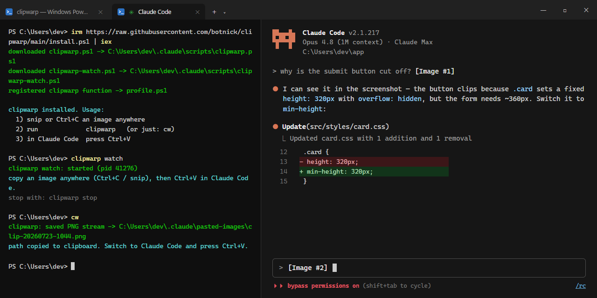

# clipwarp — paste clipboard images into Claude Code on Windows

**Fixes `Ctrl+V` image paste not working in Claude Code on native Windows.**
Screenshot with Snipping Tool / `Win+Shift+S` / Lightshot / ShareX, or "Copy
image" in a browser → `Ctrl+V` in Claude Code → image attached.

[](#requirements)
[](#requirements)
[](LICENSE)
[](#install)



## The problem: can't paste images from clipboard into Claude Code on Windows

On **native Windows**, Claude Code cannot read an image from the clipboard.
`Ctrl+V` and `Alt+V` silently do nothing after you take a screenshot with
Snipping Tool (`Win+Shift+S`), Lightshot, ShareX, or "Copy image" in a browser —
a long-standing, still-open problem tracked in
[anthropics/claude-code#22068](https://github.com/anthropics/claude-code/issues/22068),
[#26679](https://github.com/anthropics/claude-code/issues/26679) and
[#32791](https://github.com/anthropics/claude-code/issues/32791)
(`Alt+V` only works under WSL, not native Windows).

What *always* works is a file **path** pasted as text: Claude Code auto-attaches
any `.png` / `.jpg` / `.gif` / `.webp` path it sees in your message. **clipwarp**
turns whatever image is on your clipboard into exactly that — automatically.

```text
┌────────────┐      ┌────────────────────────────┐      ┌───────────────────┐
│  Ctrl+C /  │ ───▶ │  clipwarp: save clipboard  │ ───▶ │  Ctrl+V in Claude │
│  Win+⇧+S   │      │  image → PNG, put its path │      │  Code = image     │
│  anywhere  │      │  on the clipboard as text  │      │  attached ✓       │
└────────────┘      └────────────────────────────┘      └───────────────────┘
```

## Install

One command (PowerShell):

```powershell
irm https://raw.githubusercontent.com/botnick/clipwarp/main/install.ps1 | iex
```

Or from a clone:

```powershell
git clone https://github.com/botnick/clipwarp
.\clipwarp\install.ps1
```

The installer copies the scripts to `%USERPROFILE%\.claude\scripts` and registers
a `clipwarp` function (plus a short `cw` alias) in your all-hosts PowerShell
profile. Idempotent — re-run any time to update. Open a **new** terminal
afterwards (or run `. $PROFILE`) so the command is found.

No admin rights, no services, no dependencies — plain PowerShell and .NET
classes that ship with Windows. Everything runs **locally**; images never leave
your machine.

## Quick start

### Automatic (recommended): plain `Ctrl+C` → `Ctrl+V`

```powershell
clipwarp watch       # start the background clipboard watcher once
clipwarp autostart   # optional: start it at every login
```

While the watcher runs, **every image that lands on the clipboard is converted
automatically** — snip, Lightshot, browser "Copy image", `Ctrl+C` on an image
file in Explorer. Just `Ctrl+V` in Claude Code and the image attaches.

The clipboard is rewritten as **dual format**, so nothing else breaks:

| Paste target | What pastes |
|---|---|
| Claude Code / any terminal | the saved PNG's **path** (auto-attaches) |
| Photoshop, Word, Discord, browser... | the original **image** |

Copies that carry meaningful text alongside an image (e.g. a paragraph from
Word) are left untouched — only pure image copies convert.

```powershell
clipwarp status      # is the watcher running?
clipwarp stop        # stop it
clipwarp unautostart # remove the login autostart
```

### Manual: one command per paste

1. Screenshot or copy any image (`Win+Shift+S`, Lightshot, ShareX, browser...).
2. Run:
   ```powershell
   cw        # short alias for clipwarp
   ```
3. Switch to Claude Code, press `Ctrl+V`. Done.

## Supported clipboard formats

clipwarp reads the clipboard in whatever format the source app actually used —
this is what makes it work where naive `Get-Clipboard -Format Image` fails:

| Clipboard format | Typical source |
|---|---|
| `CF_BITMAP` / `CF_DIB` | Snipping Tool, `Win+Shift+S`, `PrtScn` |
| `PNG` / `image/png` stream | Lightshot, Chrome, Firefox, Discord, ShareX |
| `CF_DIBV5` (alpha, BITFIELDS) | alpha-aware apps — decoded manually, since GDI+ can't parse `BITMAPV5HEADER`+`BI_BITFIELDS` |
| `CF_HDROP` (file copy) | `Ctrl+C` on an image file in Explorer |
| HTML with `data:` URI / `file:///` src | browser "Copy image" fallback |
| Plain text that is already an image path | anything |

`.bmp` sources are transcoded to PNG (Claude Code doesn't attach `.bmp`).
Clipboard access is retried through transient locks and guarded by the
clipboard sequence number, so a slow conversion never overwrites a newer copy.

## Scripting

`clipwarp` prints the saved path, so it composes:

```powershell
$img = clipwarp -Quiet   # -> C:\Users\you\.claude\pasted-images\clip-....png
```

| Flag | Meaning |
|---|---|
| `-OutDir <path>` | Where to save PNGs (default `%USERPROFILE%\.claude\pasted-images`) |
| `-Quiet` | Print only the path |
| `-KeepImage` | Dual-format write: path as text AND the original image (what the watcher uses) |

Saved PNGs older than 7 days are cleaned up automatically.

## FAQ

### Why is `Ctrl+V` image paste not working in Claude Code on Windows?

Claude Code's terminal UI on native Windows can't read raw bitmaps from the
Windows clipboard, and `Alt+V` is WSL-only. Screenshots therefore never arrive.
Pasting a file *path* as text is the documented-by-behavior reliable route —
clipwarp automates it.

### How do I paste a screenshot into Claude Code?

With the watcher running: take the screenshot (`Win+Shift+S`, `PrtScn`,
Lightshot...), then press `Ctrl+V` in Claude Code. Without the watcher: run
`cw` after the screenshot, then `Ctrl+V`.

### Does this work with WSL?

Under WSL, Claude Code's own `Alt+V` usually works. clipwarp targets **native
Windows** (Windows Terminal, PowerShell, cmd, VS Code terminal), where nothing
else does.

### Which screenshot tools are supported?

Anything that puts an image on the Windows clipboard: Snipping Tool,
`Win+Shift+S`, `PrtScn`, Lightshot, ShareX, Greenshot, Flameshot, browser
"Copy image", Explorer file copies, Photoshop, etc.

### Is my screenshot uploaded anywhere?

No. clipwarp is a single local PowerShell script — the image is written to a
folder in your user profile and its path is put on your clipboard. Nothing
touches the network.

### Why not hook `Ctrl+V` directly?

Claude Code's TUI captures the keyboard, so PSReadLine key bindings can't fire
while it's focused. Rewriting the clipboard — manually with `cw`, or
automatically with `clipwarp watch` — is the reliable bridge.

## Requirements

- Windows 10 / 11
- Windows PowerShell 5.1 (preinstalled) or PowerShell 7 — both supported
  (clipboard access is marshalled onto an STA thread internally)
- [Claude Code](https://claude.com/claude-code) running in any native Windows terminal

## Uninstall

```powershell
.\uninstall.ps1              # remove scripts + profile function/alias
.\uninstall.ps1 -PurgeImages # also delete the saved-images folder
```

## Contributing

Issues and PRs welcome — especially reports of clipboard formats from apps that
still fail (attach the output of `clipwarp` without `-Quiet`).

## License

[MIT](LICENSE)
